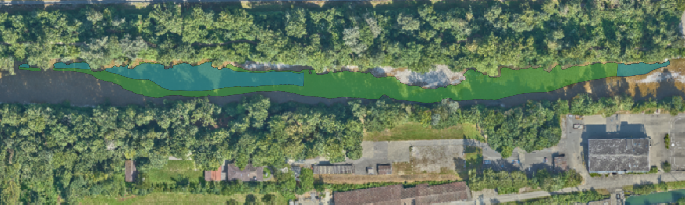

# Sensitivity Analysis of a TIR-Based Cold-Water Patch Detection Algorithm

**Author:** Etienne Dürig  
**Institution:** ZHAW Institute of Computational Life Sciences (ICLS)  
**Date:** July 2026

---

## 1. Project Overview

This repository contains the code and data associated with the Bachelor thesis 
*Sensitivity Analysis of a TIR-Based Cold-Water Patch Detection Algorithm* 
(Etienne Dürig, ZHAW ICLS, 2026).

Cold water patches (CWPs) are localised areas in rivers where the water 
temperature is measurably colder than the surrounding channel. They provide 
thermal refugia for cold-water organisms and are expected to gain ecological 
importance as river temperatures rise due to climate change. This thesis builds 
on a CWP detection algorithm developed in collaboration with the Canton of Bern, 
which processes high-resolution thermal infrared (TIR) orthophotos of the Emme 
river to detect CWPs programmatically.

The thesis addresses three research questions:

1. Can the existing algorithm be reimplemented in a computationally more 
   efficient form while producing equivalent outputs?
2. How does the step length parameter contribute to variance in detected CWP 
   area, and does this differ between tributary-caused and non-tributary-caused 
   CWPs?
3. What algorithmic modifications can reduce parameter sensitivity while 
   maintaining plausible detection results?

To answer these questions, a GDAL-based speed-optimized reimplementation (v2) 
was developed and validated against the original algorithm (v1). A Morris 
sensitivity analysis was then conducted across 24 manually selected and 
classified CWP locations, varying the step length, reference strip width, and 
temperature delta parameters. Finally, a modified algorithm (v3) was developed 
that replaces the slab-based reference temperature computation with an inverse 
distance weighting scheme, eliminating the step length parameter and resolving 
the truncation artefacts identified in the sensitivity analysis.


---
## 2. Prerequisites

> **Note:** This project was developed across two environments: a Ubuntu desktop
> for data analysis and report generation, and a Debian-based ZHAW HPC cluster
> for parallel model execution. Scripts in the `morris_screening_*/` and
> `comparison*/` directories are designed specifically for HPC execution via
> SLURM and GNU Parallel and are not intended to be run locally. All other
> scripts can be run on any Linux or macOS system with the required dependencies
> installed. Windows users are advised to install WSL 2 with Ubuntu for full
> compatibility:  
> https://learn.microsoft.com/en-us/windows/wsl/install

### 2.1 ZHAW HPC Account (recommended)

If you do not already have an account on the ZHAW HPC, submit a request at:  
https://wiki.hpc.zhaw.ch/hpcuserwiki/index.php/Access:New%3F_Get_an_account  
*(Only accessible within the ZHAW network.)*

After account creation, complete the first login and connect to the cluster:
- First login: https://wiki.hpc.zhaw.ch/hpcuserwiki/index.php/Getting_started:First_Login  
- Connect: https://wiki.hpc.zhaw.ch/hpcuserwiki/index.php/Getting_started:Connect_to_the_cluster

The cluster runs Linux. The following terminal commands will be useful for navigation:

| Command | Purpose |
|---------|---------|
| `cd` | Change directory |
| `ls` | List directory contents |
| `mkdir` | Create a directory |
| `nano` | View and edit files in the terminal |

### 2.2 Conda

If not already installed, download Conda from the official documentation:  
https://docs.conda.io/projects/conda/en/latest/user-guide/install/index.html

### 2.3 Git

**Windows**  
https://git-scm.com/install/windows

**macOS** (requires Homebrew)
```bash
brew install git
```

**Linux (Debian-based)**
```bash
sudo apt install git
```

### 2.4 GNU Parallel

GNU Parallel is required for the parallel execution scripts.

**Linux (Debian-based)**
```bash
sudo apt install parallel
```

**macOS** (requires Homebrew)
```bash
brew install parallel
```

**Windows (via Conda)**

You might add parallel to one of the environments.

```bash
conda activate r_env
conda install -c conda-forge parallel
```

---

## 3. Installation

### 3.1 Clone the Repository

```bash
git clone https://github.com/duerieti/Sensitivity-Analysis-of-a-TIR-Based-CWP-Detection-Algorithm.git
```

### 3.2 Set Up Environments

#### Option A: Using Conda (recommended)

Two separate environments are provided. Note that the environment files were
exported on Linux and may require minor adjustments on other platforms.

**Sensitivity analysis environment**
```bash
conda env create -f sensitivity_env.yml
```

**Algorithm evaluation environment**
```bash
conda env create -f r_env.yml
```

#### Option B: Using R directly

Install the required packages in R or RStudio with `install.packages()`:

```r
install.packages(c(
  "tidyverse",
  "sf",
  "terra",
  "exactextractr",
  "tmap",
  "maptiles",
  "tmaptools",
  "rcpp",
  "data.table",
  "ggplot2",
  "future",
  "furrr",
  "tictoc",
  "logger",
  "stars",
  "raster",
  "lwgeom",
  "leaflet",
  "leafem",
  "sensitivity",
  "stringdist",
  "abind"
))
```
**R version:** 4.5.3

**System dependencies** (required for geospatial packages, Linux/macOS only):
- GDAL ≥ 3.0
- GEOS ≥ 3.8
- PROJ ≥ 6.0


---

## 4. Repository Structure

```
├── comparison/                                    # Compare v1, v2, and v3 algorithm versions
│   ├── compute_jaccard.R                          # Compute Jaccard similarities between algorithms
│   ├── param_combi_1/                             # First parameter combination
│   │   ├── current/                               # v1 algorithm output
│   │   │   ├── run_function.sh                    # Execute v1 algorithm on HPC
│   │   │   └── run_model.R                        # v1 model run script
│   │   ├── new/                                   # v2 algorithm output
│   │   │   ├── run_function.sh                    # Execute v2 algorithm on HPC
│   │   │   └── run_model.R                        # v2 model run script
│   │   └── v3_12_core/                            # v3 algorithm output
│   │       ├── idw.cpp                            # IDW C++ function for v3
│   │       ├── run_function.sh                    # Execute v3 algorithm on HPC
│   │       └── run_model.R                        # v3 model run script
│   ├── param_combi_2/                             # Second parameter combination
│   │   ├── current/                               # v1 algorithm output
│   │   │   ├── run_function.sh                    # Execute v1 algorithm on HPC
│   │   │   └── run_model.R                        # v1 model run script
│   │   └── new/                                   # v2 algorithm output
│   │       ├── run_function.sh                    # Execute v2 algorithm on HPC
│   │       └── run_model.R                        # v2 model run script
│   └── param_combi_3/                             # Third parameter combination
│       ├── current/                               # v1 algorithm output
│       │   ├── run_function.sh                    # Execute v1 algorithm on HPC
│       │   └── run_model.R                        # v1 model run script
│       └── new/                                   # v2 algorithm output
│           ├── run_function.sh                    # Execute v2 algorithm on HPC
│           └── run_model.R                        # v2 model run script
│
├── comparison_for_speed/                          # Compare v1 and v2 for runtime benchmarking
│   ├── execution_speed_plot.R                     # Plot execution time comparison
│   ├── param_combi_1/                             # First parameter combination
│   │   ├── current/                               # v1 algorithm output
│   │   │   ├── run_function.sh                    # Execute v1 algorithm on HPC
│   │   │   └── run_model.R                        # v1 model run script
│   │   └── new/                                   # v2 algorithm output
│   │       ├── run_function.sh                    # Execute v2 algorithm on HPC
│   │       └── run_model.R                        # v2 model run script
│   ├── param_combi_2/                             # Second parameter combination
│   │   ├── current/                               # v1 algorithm output
│   │   │   ├── run_function.sh                    # Execute v1 algorithm on HPC
│   │   │   └── run_model.R                        # v1 model run script
│   │   └── new/                                   # v2 algorithm output
│   │       ├── run_function.sh                    # Execute v2 algorithm on HPC
│   │       └── run_model.R                        # v2 model run script
│   └── param_combi_3/                             # Third parameter combination
│       ├── current/                               # v1 algorithm output
│       │   ├── run_function.sh                    # Execute v1 algorithm on HPC
│       │   └── run_model.R                        # v1 model run script
│       └── new/                                   # v2 algorithm output
│           ├── run_function.sh                    # Execute v2 algorithm on HPC
│           └── run_model.R                        # v2 model run script
│
├── compute_morris/                                # Scripts and data for Morris sensitivity analysis
│   ├── aggregated_parameters.csv                  # Temperature delta and CWP area metrics for all 24 annotated CWP over the Morris runs
│   ├── compute_aggregated_metrics.R               # Compute temperature delta and CWP area metrics
│   ├── compute_detection_frequency_rasters.R      # Compute detection frequency rasters
│   ├── compute_morris_indices.R                   # Compute Morris indices from CWP area metric
│   └── cwp_annotated.csv                          # Bounding box and classification of the 24 selected CWP
│
├── data/                                          # Input data
│   ├── derived_data_products/                     # Pre-rounded rasters for faster computation
│   │   ├── round_obemme.sh                        # Rounding script for Emme Upper Reach 1
│   │   ├── round_v01emme.sh                       # Rounding script for Emme Lower Reach
│   │   └── round_v2emme.sh                        # Rounding script for Emme Upper Reach 2
│   └── original_data/                             # TIR data from Tonolla and Antonetti
│       ├── Centerlines_FINAL/                     # River centrelines
│       └── thermal_rasters_FINAL/                 # TIR orthophoto rasters
│
├── environments/                                  # Conda environment files
│   ├── r_env.yml                                  # Environment for algorithm execution
│   └── sensitivity_env.yml                        # Environment for sensitivity analysis
│
├── functions/                                     # Algorithm implementations and utility functions
│   ├── Cold_water_patch_detection_anto.R          # Original v1 implementation (Tonolla & Antonetti)
│   ├── CWP_code_commented_claude.r                # Commented version of the original v1 implementation
│   ├── detect_cwp_v2_internal_rounding.R          # v2 algorithm with internal TIR raster rounding
│   ├── detect_cwp_v2.R                            # v2 algorithm without internal rounding
│   ├── detect_cwp_v3.R                            # v3 algorithm (IDW-based reference temperature)
│   ├── function_current.R                         # v1 algorithm isolated as a standalone function
│   ├── idw.cpp                                    # IDW function in C++ for v3 (imported via Rcpp)
│   ├── jaccard.R                                  # Jaccard similarity computation
│   ├── sample_parameters_big.R                    # Second Morris parameter grid generation
│   └── sample_parameters.R                        # First Morris parameter grid generation
│
├── morris_screening_emme_v1/                      # Parallel model execution for Emme Lower Reach (first Morris experiment)
│   ├── params.txt                                 # Sampled parameter tuples
│   ├── run_model.R                                # Execute the CWP detection algorithm for one parameter tuple
│   ├── run_parallel_jobs.sh                       # Orchestrate parallel execution via GNU Parallel
│   └── run_parameter_sampling.sh                  # Sample parameter tuples from the Morris design
│
├── morris_screening_emme_v1_more_params/          # Parallel model execution for Emme Lower Reach (second Morris experiment)
│   ├── params.txt                                 # Sampled parameter tuples
│   ├── run_model.R                                # Execute the CWP detection algorithm for one parameter tuple
│   ├── run_parallel_jobs.sh                       # Orchestrate parallel execution via GNU Parallel
│   └── run_parameter_sampling.sh                  # Sample parameter tuples from the Morris design
│
├── morris_screening_emme_v2/                      # Parallel model execution for Emme Upper Reach 2 (first Morris experiment)
│   ├── params.txt                                 # Sampled parameter tuples
│   ├── run_model.R                                # Execute the CWP detection algorithm for one parameter tuple
│   ├── run_parallel_jobs.sh                       # Orchestrate parallel execution via GNU Parallel
│   └── run_parameter_sampling.sh                  # Sample parameter tuples from the Morris design
│
├── morris_screening_emme_v2_more_params/          # Parallel model execution for Emme Upper Reach 2 (second Morris experiment)
│   ├── params.txt                                 # Sampled parameter tuples
│   ├── run_model.R                                # Execute the CWP detection algorithm for one parameter tuple
│   ├── run_parallel_jobs.sh                       # Orchestrate parallel execution via GNU Parallel
│   └── run_parameter_sampling.sh                  # Sample parameter tuples from the Morris design
│
├── morris_screening_obemme/                       # Parallel model execution for Emme Upper Reach 1 (first Morris experiment)
│   ├── params.txt                                 # Sampled parameter tuples
│   ├── run_model.R                                # Execute the CWP detection algorithm for one parameter tuple
│   ├── run_parallel_jobs.sh                       # Orchestrate parallel execution via GNU Parallel
│   └── run_parameter_sampling.sh                  # Sample parameter tuples from the Morris design
│
├── morris_screening_obemme_more_params/           # Parallel model execution for Emme Upper Reach 1 (second Morris experiment)
│   ├── params.txt                                 # Sampled parameter tuples
│   ├── run_model.R                                # Execute the CWP detection algorithm for one parameter tuple
│   ├── run_parallel_jobs.sh                       # Orchestrate parallel execution via GNU Parallel
│   └── run_parameter_sampling.sh                  # Sample parameter tuples from the Morris design
│
└── testing_function_v3/                           # Standalone test scripts for the v3 algorithm
    ├── idw.cpp                                    # Copy of the IDW C++ function for testing
    └── run_new_function.R                         # Test script for the v3 algorithm

```
