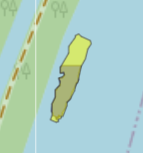
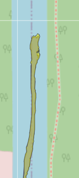
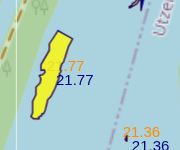
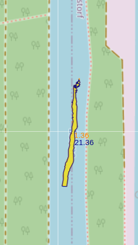

# Protocoll
```{r}

#install.packages("sensobol")
#install.packages("deSolve")
install.packages("tidyverse")

```


```{r}
library(deSolve)
library(sensobol)
library(tidyverse)

```


```{r}

log_growth <- function(t,N,parms) {
    r <- parms[1]
    K <- parms[2]
    dNdt <- N*r*(1 - (N/K))
    list(n_cells = dNdt)
}


```

```{r}

t <- seq(0, 50, 0.1)
N_start <- 2
K <- 10^4
r <- 0.2

```

```{r}
bacterial_growth <- deSolve::rk(y = N_start,times =t,parms = c(r,K), func = log_growth
)

bacterial_growth %>%
    as_tibble() %>%
    mutate(n_cells = `1`) %>%
    ggplot(aes(x = time, y = n_cells)) + geom_line()

```

### Sensitivity analyis

We might not know K and r with perfect accuracy, but there might be some uncertainty. We can use sensobol to do variance decomposition

```{r}
bacterial_growth <- deSolve::rk(y = N_start,times =t,parms = c(r,K), func = log_growth
)

bacterial_growth %>%
    as_tibble() %>%
    mutate(n_cells = `1`) %>%
    ggplot(aes(x = time, y = n_cells)) + geom_line()


```

```{r}

mat <- sensobol::sobol_matrices(
    matrices = c("A", "B", "AB", "BA"),
    N = 2^11,
    params = c("r", "K"),
    order = "second",
    type = "LHS"
)


nrow(mat)
ncol(mat)
```


```{r}

?rk

mat[, "r"] <- qunif(mat[, "r"],0.17, 0.23)
mat[, "K"] <- qunif(mat[, "K"], 0.5* 10^4, 1.5*10^4)
```

```{r}
mat %>%
    as_tibble() %>%
    ggplot(aes(x = r)) + geom_histogram()


mat %>%
    as_tibble() %>%
    ggplot(aes(x = K)) + geom_histogram()

```


```{r}

N_start <- 2
t <- seq(0, 50, 0.1)

bact_growth_run <- function(r,K) {


    bacterial_growth <- deSolve::rk(y = N_start,times=t, parms = c(r,K), func = log_growth) %>% 
        tail(n = 1) %>% as.data.frame()
return(bacterial_growth)


}


```

```{r}


res <- map2_dfr(mat[,"r"], mat[,"K"], bact_growth_run) %>% as_tibble()


```

```{r}


res  %>% 
    as_tibble() %>%
    mutate(
        cell_count = `1`
    ) %>% select(!`1`)


```

```{r}

sobol_indices(
    matrices = matrices,
    Y = 
)

```

So the computation of the sobol indices is hidden behind this function. And the model has to be passed to the function. So I currently see no real way of applying this function to the cold-water detection algorithm. Because the CWP algorithm is a function with a multidimensional output. -> If I however do not find a way of performing a spatial sensitivity analisis and need to lump the model into a scalar value, then `sensobol`would become an opportunity again. ` sensobol` however is a great tool to create the matrices so that I can then run the model. 


--- 

## Testing multisensi

There is a function called mutlisensi, that claims to implement spatial sensitivity analsis. I looked into this too, but to me it seems like the multi sensi function is more of a wrapper around the generall sensitivity topic + it can not callculate the pixle wise sobol indices in parallel. But it features great tools to boil down the dimensionality of the model output => If the computation gets to expensive, then this could hoste a sollution.


--- 17.03.2026


- Recieved the data. Set up the git repository and deposited all the data
- Then I started analysing the code -> hard to read, so i used claude sonnet 4.6 to get commented out version of the  code 
- Got the high level structure of the code. Identified that this has an inner loop and an outer loop.
- The outerloop runs the cold water detection algorithm over hyperparameters.
- So the whole structure around this is not of interest right now. I need to make this CWP algorithm go fast and not the whole hyperparameter search funcitonality.
- So i tasked claude opus 4.6 to extract the CWP algorithm from the code an write it to a new R script. Also It should set up the loading in of the data.
- Now I will perform timing and generally start dooing optimisation using profiling.


I then hit a brick wall. Bad alloc, some c++ problems under the hood. -> I understand that I have to take a closer look at the individual rasters, their size, do some loading in myself ect. I can not just dive head in. So i inspected all the rasters with gdal.

Terra extract seems to be a very memory hungy step. I think this is because it generateds a dataframe and puts the complete dataframe into memory. And this is just to much memory allocation for my "standart device". On a device with much more memory, this step however might be absolutely no Issue. The question now is, what to do. Should I just go to the HPC imediately ? Because large memory consumption does not realy mean bad performance in a  way. Or should this step be rethought to something that is less memory hungry ? -> 

I think this can actually also bee done with zonal statistics and reclassificaiton ? 


This might be a possibility. This then however might cause issues with having to compute the mean around the buffer. Hmm its a pretty hard problem.

I think the best thing for me to do right now is to get a jupyter notebook, and visually interpret and decompose the code segment by segment. This, because it is actually so complicated, that I am pooking around in a stack of hay on the look for a needle right now.


### March 19 ---

Finished the code that I ran in my jupyter notebook (did that because terra::explode in their function caused bad::alloc) issues for me. My code worked in the jupyter notebook, but now that i wraped everything into a function, i get bad alloc too. Could it be due to memory allocation of R for functions ? I have to look into that right now (I allready used gc() and rm() to help with the garbage collection, but this is of no help appraently). After reseach i found that terraOptions(memfrac) can be used to set the amount of memory that terra is allowed to consume. I increased that to 0.8. Maybe the other function from the Hydro team works to now on my pc. Because this PC has 30 GB of memory, so there is some room and a realistic chance that the computer can handle the memoryspike.

-- The terra memory adjustment has not really worked, it still crashed at the same location. I improved rm() gc() now. If this won't work, then I am going to move to the HPC. Not even this worked, moving to the hpc as I just have to little memory apparently?


### March 20 ---

So their algorithm apparently works without spikes on the HPC. Ab it over an hour of time is needed to run. My algorithm still has this large memory spike that appraently goes over 80 GB. Did i programm somehting wrong? I decided to first deploy a writing step so that terra can stream the dataset through memory instead of having to hold everything in memory Maybe this resolves the issue. Because I think there is a decent chance that i can beat 1h 15 min with this by a decent margin. And I gues the Idea of great hpc developement holds everything in memory is very much nonrealisitc when working with Geodata anyways. The rasters are large and so there is much space taken up in memory -> We can run out quite quickly in generall. GDAL therefore adresses this very valid concern by streaming opertaions from file to file and use the limited memory. And GDAL is just the mother of all beasts, so terra, rasterio, QGIS, ArchGIS etc they all use GDAL under the hood. Therefore they rely on streaming the data from one disk location (file) to another (a second file). And I gues with that in mind, an extra deliberate writing step doesn't hurt in any way (because reading and writing happens all the time anyways) (Its visible in htop that a decent amount of time is spent for IO).

And I gues since the writing and reading problematic is generally unavoidable, we can do some bash and and use gdal directly over the command line (we can also user a smaller datatype here). THe question remains hoever wheter we can tell GDAL to only use a fixed memory quota like 20 GB. Otherwise paprallelisation could become nightmarish.

Maybe the issue comes from the median calculation. sum, min, max, mean. All these functions can be streamed through memory. median needs to order all numbers. So all numbers need to be held in memory and sorted in order to find the median. So in a way, the median is exactly the function which causes this problem. So terra zonal operations are simply not a possibility here. We have to use extract_extract or something here and simply hope, that this works more gracefully.

extract extract works. Now there is a later issue in a filter step somewhere at the end of the function (happens after 40 mins, so i gues this function is marginally faster the the other one). This is acutally an error in extract extract i beliefe. So it is not faster after al but much much slower ? I generally do not know anymore ...
Anyways, I'm just gonna use terra::extract now. Hopefully this works (it works in their code, so we will see). 

Then next I tought about how I potentially could parallelize this. And I think it is rather apparent now, that the only real mode of parallelisaiton is mutliprocessing here. Because there don't seem to be any parallelisation possibilities with gdal as multi threading generally is not as supported as I first assumed it to be. So we are just gonna run with mutliprocessing. And I should definitely also try to use bash to chain GDAL computations and R compitations together. This mainly, because I noticed that there is no way to handle all these runs with this slow code. I got to speed it up. And if GDAL on the command line is the only solution, then so be it.

```{r}

getwd()

library(terra)
library(sf)
library(dplyr)
library(lwgeom)
library(tidyverse)
library(tictoc)
library(tmap)

path_raster <- "data/thermal_rasters_FINAL/mean_v01emme.tif"
path_line <- "data/Centerlines_FINAL/Emme_V01.shp"
terra_tmp <- file.path(tempdir(), "terra_work")
dir.create(terra_tmp)

terraOptions(memmax=49)
terraOptions(tempdir=terra_tmp)

detect_cwp_single <- function(
    ras_path,
    line_path,
    step_m            = 500,
    buffer_px         = 3,
    delta_C           = 1.0,
    min_patch_area_m2 = 2,
    round_to          = 0.1,
    slab_halfwidth_m  = 60,
    connect_diagonals = TRUE,
    union_chunk_size  = 50000L
) {

r <- terra::rast(path_raster)
line <- sf::st_read(path_line, quiet = TRUE) |> sf::st_zm(TRUE, "ZM")
  
stopifnot(terra::nlyr(r) == 1)
names(r) <- "T"
if (terra::is.lonlat(r)) stop("Raster must be in a metric CRS.")

rres   <- terra::res(r)
cell_m <- mean(rres)

if (!is.na(sf::st_crs(line)) &&
  !identical(terra::crs(r), sf::st_crs(line)$wkt)) {
  line <- sf::st_transform(line, terra::crs(r))
}

g <- sf::st_union(line)
  
if (inherits(g, "sfc_GEOMETRYCOLLECTION"))
  g <- sf::st_collection_extract(g, "LINESTRING")
if (inherits(g, "sfc_MULTILINESTRING")) {
  g <- sf::st_line_merge(g)
  if (inherits(g, "sfc_GEOMETRYCOLLECTION"))
    g <- sf::st_collection_extract(g, "LINESTRING")
}
  
rfactor <- if (!is.null(round_to) && round_to  > 0) 1 / round_to  else NA_real_

L <- as.numeric(sf::st_length(line))
S <- step_m

pos <- sort(unique(c(0, seq(0, 1, by = S / L), 1)))
npt <- length(pos)

if (npt < 2) stop("Too few stations for step = ", S)

from <- pos[1:(npt - 1)]
to   <- pos[2:npt]
k    <- length(from)

g1 <- sf::st_geometry(line)[1]

subs_list <- vector("list", k)
for (j in seq_len(k)) {
  subs_list[[j]] <- lwgeom::st_linesubstring(g1, from[j], to[j])
}

subs <- do.call(c, subs_list)


slabs <- sf::st_buffer(subs,
                       dist        = slab_halfwidth_m,
                       endCapStyle = "FLAT",
                       joinStyle   = "MITRE",
                       mitreLimit  = 2)
slabs_sf <- sf::st_sf(geometry = slabs)


slabs_terra <- terra::vect(slabs_sf)

buffer_m <- cell_m * 3

slabs_buffer <- sf::st_buffer(subs,
                              dist        = buffer_m,
                              endCapStyle = "FLAT",
                              joinStyle   = "MITRE",
                              mitreLimit  = 2)
slabs_buffer_sf <- sf::st_sf(geometry = slabs_buffer)


slaps_buffer_vect <- slabs_buffer_sf %>%
  mutate(slap_id = row_number()) %>%
  terra::vect()


slabs <- sf::st_buffer(subs,
                       dist        = slab_halfwidth_m,
                       endCapStyle = "FLAT",
                       joinStyle   = "MITRE",
                       mitreLimit  = 2)

slabs_sf <- sf::st_sf(geometry = slabs)

slaps_sf_vect <- slabs_sf %>%
  mutate(slap_id = row_number()) %>%
  terra::vect()


zone_r_big <- terra::rasterize(slaps_sf_vect, r, field = "slap_id")

print("round r")
r_rounded <- round(r * rfactor) / rfactor


print("calculating median per slab with exactextractr")

median_vals <- terra::extract(r_rounded, slaps_buffer_vect,
                                             fun = "median",
                                             na.rm =TRUE)


median_vals

print("doing mean calculation")
Tmean <- terra::classify(zone_r_big, median_vals)

                            

print("raster algebra")
flagged_pixels <- r_rounded - Tmean
binary <- flagged_pixels <= (-1 * 1.0)
                

patches_large <- patches_sf %>%
  filter(as.numeric(st_area(.)) >= 2) %>%
  mutate(ID = row_number())


print("raster statistics")
stats_per_poly <- terra::extract(r_rounded, patches_large) %>%
  group_by(ID) %>%
  summarise(
    mean_temp   = mean(T),
    min_temp    = min(T),
    max_temp    = max(T),
    median_temp = median(T)
  )

patches_large_with_stas <- patches_large %>%
  left_join(stats_per_poly, by = "ID") %>%
  select(!T)


slab_means <- terra::extract(Tmean, vect(patches_large_with_stas), fun = "mean") %>%
  rename(slab_mean_T = slap_id)

final_patches <- patches_large_with_stas %>%
  left_join(slab_means, by = "ID") %>%
  mutate(deltaT = slab_mean_T - mean_temp) %>%
  filter(deltaT >= delta_C)

return(final_patches)

}

detect_cwp_single(path_raster, path_line)

unlink(terra_tmp, recursive=TRUE)


?terraOptions
```


The rounding is an invariant step. So we could actually just round the raster once and then save it to disk -> this would allready be another huuuge timesave.

-> My code runs now, an I am rather certain, that it is slower than the original code. Also, it seems like my code is faster on my local pc than on the cluster. Is this the IO issue, that I am running into ? I am going to move the rasters to the compute node at the beginning so that the disk on the compute node is used -> less

The code runs not completely I noticed, it fails at a later stage

Also I now move the data to the local disk of the node first in hopes of a speedup when dooing terra extract. Because on my computer this takes like 30 seconds, on the hpc this takes around 20 mins or so. So disproportionately longer. Hopefully this helps. I also checked the location of the tempdir. Thisone seems to be directly on the nodes disk. 

Update: I am quite certain that this did in fact not help. Why ? I am running into a roadblock here.
-> Mutlithreading ?: Im gonna test this. I assigned 15 cores to the code now. Looked at HTOP. Loading the data and rounding does not use mutli threading. maybe terra::extract does ? 
-> IO ? Maybe this assumption that the node has its own disk is wrong ? Something flashed up on htop but only for a small split second. To me it looks like terra extract just performs very small calculations in a sequential manner
-> Memory fraction ? Memory fraction and memmax are exactly the same on my pc and on the hpc setup. I have to go and read the hpc wiki about the disk setup. Also I have to find a diagnosis tool/ library that shows me network traffic of my processes and stuff -> What a great OSI revision. So this is a linux based cluster, so actually ther might be some interesting OSI stuff here.

The rounding step takes 12 mins btw, so doing this once would be best. If the IO stuff is realy such a big problem, then maybe I got to hold stuff in memory ?


Before I dive in that deep lets just try terra::zonal again. Because I am rather certain that the big memory spikes that I experienced are actually comming fom the fact that i accidentaly passed the complete slaps to the function and not the buffer slaps (which are a magnitude smaller). -> No that was not the case. So I am certain that the problem is IO bound. New strat: Get function working, then profiling both functions -> merge -> 


I did more research using claude. Indeed geotiff is not the best file format right now. It would be best to change to a more suited format. These cloud optimized geotiffs or whatever they are called -> these would be great


### Parallelisation or I/O ?

I checked with sacct -j 272575 how much time is spent with the CPU active and how much timeis spent with the CPU in idle -> waiting for IO. The cpu is running all the time -> the performance is not blocked by IO, its blocked by cpu.

I will therefore let claude set up parallelisation with file chunking for certain operations, where this is possible.


### Parallelism in R

I tried terras::app function to perform some of the raster computation in parallel. But my 30 GB ram computer runs out of memory If I am runnign 2 cores. 
I beliefe that parallelism in R is just fundamentally flawed in a way. In order to do parallelism in R, different processes are spawned. Each process must have its own memory block. -> Data has to be copied => this is just fundamentally to expensive.


### Trying to run with system() and gdal.

Gdal on the command line seems to be way faster for some operations. Maybe we can outsource some computations. This is what I am going to do next.

I noticed two things: Running GDAL with system() on the command line is a bit of a hussle to set up, but it brings along large time savings. In the order of 66% to 55% and for some it is a massive speedup.

Then i also noticed that exact_extract is massively faster on chunked files. Possibly because if a polygon just falls into one or mutlible chunks, all that has to be done is to read that chunk and not a whole array of lines that need to be read. And since this algorithm uses exact_extract 3 times, this ammounts to a decent speed up.

I'm gonna finish up the gdal only version now and then compare to the non gdal version and then also to the original code version.


### The four functions

-> Original function crashes -> terra::extract. I got to run this on their machine
-> function_terra.R -> Original function implemented relying heavily on the terra package -> all loops are replaced by raster computations. The main idea was here to decrease the proportion of time spent in the interpreted R language into the compiled C++ language. -> C++ is just much faster, so you wanna spend as much time there as possible. Further I was under the impression that terra or underlying gdal has easy parallelisation access backed in, so I tried to express the workflow with a set of functions that allow for easy prallelisation. Further I saw in an exercise how much faster pure GDAL over the commandline can be comprared to terra. Terra is built on GDAL, so whatever is possible in Terra, almost certaintly is also possible in GDAL. For that reason I also knew, if I can express everything using the classical vector and raster opertations (zonal, focal, raster algebra, rasterize, poylgonize) etc, then I can later outsource to gdal. Sadly terra and gdal do not feature parallelisation (I was under the naive assumption that gdal for shure allows for mutli threaded computation. Propably thought so because numexpression and numpy can do this over the OPENBLAS dependency. It is unfortunately not the case). Also i replaced terra::extract with exact_extract from the exactextractr package. Not shure which one is more performative, but exact_extractr does not load the whole raster into memory when doing the calculations (which i susspect for terra::extract) and also has a C++ backbone so it is very fast. Execution time on my device: 33 min


-> function_gdal.R: Whenever possible, I substituted the terra operations with the faster gdal operations using the system() function and strings. On my computer 21 min.

-> function_gdal_chunked.R : Here I am writing my files in a chuncked manner. This makes exact_extract perform much better. The reason for this lies in the way geotiffs are written. They are written to disk in a manner where each

row 1:  [pixel 1, pixel 2, pixel 3, ... pixel N]  ← written first
row 2:  [pixel 1, pixel 2, pixel 3, ... pixel N]
row 3:  [pixel 1, pixel 2, pixel 3, ... pixel N]
...
row M:  [pixel 1, pixel 2, pixel 3, ... pixel N]  ← written last

So if a polygon spanns mutlibe scannlines, they all have to ber written in order to get the necessairy pixels. If we read in chuncks however, only two reading opperations are neccessairy per chunk, so much less reading -> much better performance. Execution time on my device: 16 min.


### Onto the HPC

-> I think the secret to succes is to write and read large chunks of data.

function_gdal_compressed + large chache size.R :

function_gdal_chunked.R : Actually, this function was super duper fast. The same speed as on my computer. Don't realy know why tho. But I mean, I take it. But I have to look into this, because this was "to easy" so something must be wrong.

function_gdal.R:

took 20 mins to run. Just like on my device. But I did not do any chunking. What is going on ?? I realy did not expect it to turn out like this. Why is there no issue here?? Lets check the terra function. Maybe terra is just utter trash in handling distributed file systems or whatever

function_terra.R:

yea I am very possitive that terra actually has some issues with distributed file systems or something else on the HPC. Because it takes dispropotionally longer for this stuff to run on the HPC than on my device but only for the terra workflow. Got no idea why -> This would be very interesting to figure out. Maybe it is the temp directory which is setup somewhere where a lot of networking is needed. This version of the code took 44 minutes oposed to the 31 minutes on my device. So arround 15 mins more


function_gdal_with_large_chache_and_chunking: 
Chache was set to 16 GB, but it did not realy yield a speed up


function_gdal_with_chunking_and_compression:

compression was set for all gdal operations. It takes longer -> this makes rather sense since I noticed a while ago that the computation is not I/O bound but it is CPU bound. Meaning the CPU is the bottle neck. So adding more computation steps to the cpu (compressing and decompressing does not realy yield an improvement obviously). Takes 25 minutes -> so this is worse.


function_original:

-> Takes 54 mins allready on the hpc


### Traching down algorithmic differences


If my code realy should be an improvement of the existing code, then it needs to produce the exact same results as the original code. I allready noticed  view days ago, that there was one mayor conceptual bug left in the gdal calculation step. This bug arised since the slabs are larger than the river raster. And the way I set up the raster algebra, yielded some funny interactions with the nondata values in the raster. Namely, when you do calculations, then the nondata values get interpreted as realy numbers too. So in order to combat this i specifically set up a rule to ensure that nodata fields are treated correctly.


Now I ploted the output of the optimized code and the output of the current code using tmap. (Both are polygons). The output mostly seems to allighn howerver there are some very minor differences plus some larger polygons where I am wondering why and how the differences come to be.

Observations:

For one patch I can see small holes which are present in the old version but not in the new one


For this one, half of the plot is missing in the new version. Wonder what happend her



for another one you got some weird gaps again which are not filled up in the original function


Here we got a similar issue again, the new function captures a nit more than the old one



The new code seems to spot less than the current code

-> Mabye in the thresholding ? 
-> Maybe in the dialating into shrinking step?


Lets first compare both binary rasters


### Overlapping slab polygons

I found the first issue. The slab polygons that are beeing created are actually overlapping at certain boundaries. Their code loops through slabs. All pixels covered by a slab are subject of extraction and pixel flagging. So pixels that lie within an intersection of two slabs are first compared to the mean of the fist slab and the mean of the second slab. So they have the possibility to be flagged twiche. My code is different in the sense that each pixel only gets accounted towards one slab and only gets flagged with respect to the median temperature of one slab. So this yielded the differences in


### Rounding errors

I just found another issue I think!!! they did the subtraction of the rounded slab median rounded to one decimal point. This has very much gotten rid of all the small pixel differences at the edges of the cold water patches. They are all 100% deckungsgleich now. The ony exception are 3 cold water patches which are no no longer detected by the new algorithm. I wonder why. Probably because the median temperature of the slab is higher in my function than in theirs or the slab median in my function is lower than in theirs. Lets figgure it out. If we got this, then thats a humongous win.


I now looked at the mean values. Almost the same. But some patches are slightly different and some are two patches.


Lastly, the last remaining difference to be sorted out why some patches are droped.


This patch is sorted out but has exaclty the same median value as in the old algorithm.


This plot also has the exact same median value as produced by the old algorithm but still gets sorted out.




So I think it has become rather clear that the issue lies not in the median temperature of th patches, but the issue lies in something else. But what might this be?


 T_med) %>% pull(median_of_slab) %>% unique()
 [1] 20.9 20.7 19.7 22.7 21.6 18.4 16.8 19.2 21.3 21.4 21.9 22.4 23.0
[14] 21.8 19.6 20.2 20.1 20.0 19.9 19.8
> polys_current$Tmd_slb %>% unique()
 [1] 20.0 19.8 19.6 19.7 19.9 20.1 20.2 21.3 21.8 20.9 16.8 22.4 22.7
[14] 21.4 23.0

It seems like there are more unique slab temperatures in my code than in the old code. Difficult, difficult. Might this be due to terra::extract or to rounding or something. It for sure shows that the slab mean temperatures seem to be different. Well this is also no wonder given that exact_extract does indeed also treat partially overlapping pixels differently.